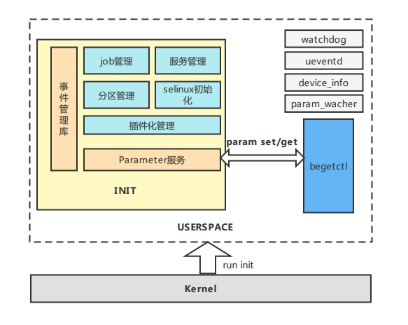

# 启动子系统<a name="ZH-CN_TOPIC_0000001129033057"></a>

## 简介<a name="section469617221261"></a>

init组件负责处理从内核加载第一个用户态进程开始，到第一个应用程序启动之间的系统服务进程启动过程。启动恢复子系统除负责加载各系统关键进程之外，还需在启动的同时设置其对应权限，并在子进程启动后对指定进程实行保活（若进程意外退出要重新启动），对于特殊进程意外退出时，启动恢复子系统还要执行系统复位操作。

## 系统架构

**图 1** OHOS启动框架图<a name="fig99659301300"></a>


## 目录<a name="section15884114210197"></a>
仓目录结构如下：
```
base/startup/init/
├── device_info         # 提供设备信息的SA服务
├── initsync            # 同步命令（小型系统）
├── interfaces          # 对外接口
├── scripts             # 脚本（LiteOS系统使用）
├── services
│   ├── begetctl        # 命令集合。提供服务的dump,拉起等一系列命令
│   ├── etc             # init配置文件目录（标准系统）
│   ├── etc_lite        # init配置文件目录（小型系统）
│   ├── include         # init头文件目录
│   ├── init            # init核心功能源码
│   │   ├── adapter     # 内核适配层
│   │   ├── include     # 头文件目录
│   │   ├── lite        # init核心功能源码（小型系统）
│   │   └── standard    # init核心功能源码（标准系统）
│   ├── log             # init日志部件。
│   ├── loopevent       # 事件库
│   │   ├── include     # 头文件目录
│   │   ├── loop        # 基于epoll封装的I/O多路复用接口
│   │   ├── signal      # 信号处理接口封装。提供信号的添加，handler注册等功能
│   │   ├── socket      # socket通信接口
│   │   ├── task        # 事件的抽象任务，如signal， timer等事件都要创建对应task
│   │   ├── timer       # 定时器接口
│   │   └── utils       # loopevent通用接口
│   ├── modules         # 插件化模块
│   │   ├── bootchart   # bootchart插件化源码
│   │   ├── bootevent   # bootevent插件化源码
│   │   ├── init_hook   # init提供的回调函数
│   │   ├── reboot      # reboot插件化源码
│   │   ├── seccomp     # seccomp插件化源码
│   │   └── selinux     # selinux插件化源码
│   ├── param           # 系统参数部件
│   └── utils           # init通用接口
├── test                # init组件测试用例源文件目录
├── ueventd             # ueventd服务源码
│   ├── etc             # ueventd配置文件目录
│   ├── include         # ueventd头文件目录
│   ├── lite            # ueventd核心功能源码（小型系统）
│   └── standard        # ueventd核心功能源码（标准系统）
└── watchdog            # 看门狗服务源码
```


## 约束<a name="section12212842173518"></a>

目前支持小型系统设备（参考内存≥1MB），标准系统Hi3516DV300、Hi3518EV300以及RK3568等

## 说明<a name="section837771600"></a>

详细使用说明参考开发指南：

[启动恢复子系统概述](https://gitee.com/openharmony/docs/blob/master/zh-cn/device-dev/subsystems/subsys-boot-overview.md)
[引导启动配置文件](https://gitee.com/openharmony/docs/blob/master/zh-cn/device-dev/subsystems/subsys-boot-init-cfg.md)
[jobs管理](https://gitee.com/openharmony/docs/blob/master/zh-cn/device-dev/subsystems/subsys-boot-init-jobs.md)
[插件](https://gitee.com/openharmony/docs/blob/master/zh-cn/device-dev/subsystems/subsys-boot-init-plugin.md)
[沙盒管理](https://gitee.com/openharmony/docs/blob/master/zh-cn/device-dev/subsystems/subsys-boot-init-sandbox.md)
[服务管理](https://gitee.com/openharmony/docs/blob/master/zh-cn/device-dev/subsystems/subsys-boot-init-service.md)
[系统参数](https://gitee.com/openharmony/docs/blob/master/zh-cn/device-dev/subsystems/subsys-boot-init-sysparam.md)
[日志管理](https://gitee.com/openharmony/docs/blob/master/zh-cn/device-dev/subsystems/subsys-boot-init-log.md)
[组件化启动](https://gitee.com/openharmony/docs/blob/master/zh-cn/device-dev/subsystems/subsys-boot-init-sub-unit.md)
## 相关仓<a name="section641143415335"></a>

**[startup\_init\_lite](https://gitee.com/openharmony/startup_init_lite)**
[startup\_appspawn](https://gitee.com/openharmony/startup_appspawn)
[startup\_bootstrap\_lite](https://gitee.com/openharmony/startup_bootstrap_lite)
